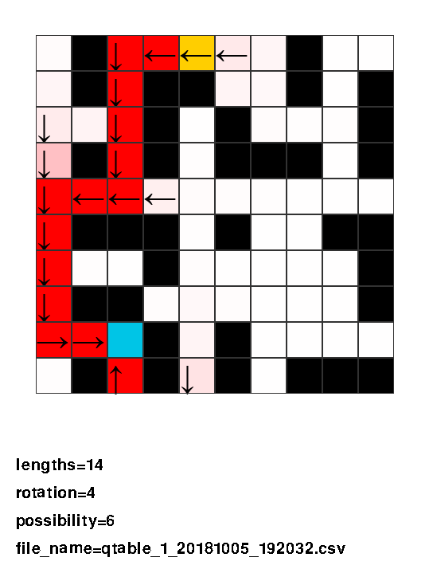

# Qtable_viewer
QtableのCSVファイルを図示するプログラム  
※random_Q_lerningのCSV formatにしか対応していません

---

## HOW TO USE

1. main.pyに記載の[FOLDER_PASS]にCSVファイルの格納先を指定する
2. main.pyを実行
  
アローキー右 : 進む  
アローキー左 : 戻る  
Q : 終了  
s : 特徴量データをinfomation.csvに保存(後述)

---
## Introduciton of files

1. main.py : メインの実行用スクリプト
2. map_date.py : マップデータ
3. const.py : 各種設定用スクリプト
---

## Format
    

黄色がスタート地点、青がゴール地点を表す  
行動価値が高くなればなるほど、色が濃くなっていく  
矢印は行動の方向を表す
### 特徴量データ
length : エージェントの経路長  
rotation : エージェントの回転回数  
possibility : エージェントが取り得る他の経路数